# PratibhaAI — Discover Talent, Powered by AI

AI-powered autonomous interview platform with:
- Real-time emotion analysis
- Hindi + English bilingual support  
- IT + Non-IT candidate tracks
- Resume-based adaptive questions

## 🚀 Problem Statement

Traditional hiring processes are often time-consuming, prone to human bias, and difficult to scale. HR professionals and technical recruiters spend countless hours manually screening resumes and conducting preliminary interviews. Furthermore, ensuring a consistent and fair evaluation across all candidates can be challenging, leading to suboptimal hiring decisions and a poor candidate experience.

## 💡 Solution
The **PratibhaAI** platform is an intelligent, automated platform designed to streamline the recruitment pipeline. It provides an end-to-end solution for candidate screening and interviewing:
- **Smart Resume Parsing:** Automatically extracts information from uploaded resumes and calculates a domain/job-role fit score.
- **Retrieval-Augmented Generation (RAG):** Enhances AI responses by retrieving context from documents and domain knowledge to provide highly accurate, relevant interactions.
- **Adaptive AI Interviews:** Utilizes advanced LLMs (via Groq) to generate dynamic, context-aware interview questions based on the candidate's profile and previous answers.
- **Real-time Evaluation:** Evaluates candidate responses in real-time during the interview loop.
- **HR Dashboard & Reporting:** Provides recruiters with a comprehensive dashboard to manage candidates, view detailed AI-generated PDF reports, and make informed selection or rejection decisions.

## 🛠 Tech Stack

### Frontend
- **Framework:** React 18 with Vite
- **Language:** TypeScript
- **Styling:** Tailwind CSS, Lucide React (Icons)
- **State Management:** Zustand, React Query
- **Routing:** React Router DOM
- **Charts/Visuals:** Recharts
- **Real-time Communication:** Socket.io-client

### Backend & AI Core
- **Framework:** FastAPI (Python)
- **AI Core & Orchestration:** LangChain, LangGraph
- **LLM Integration:** Groq API
- **RAG (Retrieval-Augmented Generation):** 
  - **Embeddings:** `sentence-transformers`, `HuggingFace Hub`
  - **Vector Database:** PostgreSQL with `pgvector`
- **Database & ORM:** MongoDB (Motor), PostgreSQL, SQLAlchemy
- **Document Processing:** PyMuPDF, PyPDF2
- **Authentication:** PyJWT, bcrypt
- **Text-to-Speech:** Edge-TTS

## 🏗 Application Architecture & Workflow

Below is the complete architectural flowchart of the **PratibhaAI** platform, showcasing how data flows from the Web Portals down to the AI Services and Database layer:

```mermaid
flowchart TD
    %% Define Styles
    classDef portal fill:#f3e5f5,stroke:#8e24aa,stroke-width:2px,stroke-dasharray: 5 5
    classDef hr fill:#e0f2f1,stroke:#00897b,stroke-width:2px,stroke-dasharray: 5 5
    classDef cand fill:#e8eaf6,stroke:#3949ab,stroke-width:2px,stroke-dasharray: 5 5
    classDef realtime fill:#fbe9e7,stroke:#d84315,stroke-width:2px,stroke-dasharray: 5 5
    classDef backend fill:#e3f2fd,stroke:#1e88e5,stroke-width:2px,stroke-dasharray: 5 5
    classDef ai fill:#e0f7fa,stroke:#00acc1,stroke-width:2px,stroke-dasharray: 5 5
    classDef db fill:#e8f5e9,stroke:#43a047,stroke-width:2px,stroke-dasharray: 5 5
    classDef deploy fill:#fff8e1,stroke:#ffb300,stroke-width:2px,stroke-dasharray: 5 5

    %% 1. Admin Portal
    subgraph AdminLayer ["Admin Portal (Company Owner)"]
        direction LR
        A1[Analytics]
        A2[HR Management]
        A3[Platform Settings]
    end
    class AdminLayer portal

    %% 2. HR Portal
    subgraph HRLayer ["HR Portal (React + Tailwind)"]
        direction LR
        H1[Job Setup]
        H2[Resume Upload & Parse]
        H3[Shortlist Panel]
        H4[Reports Generation]
    end
    class HRLayer hr

    %% 3. Candidate Interview Room
    subgraph CandidateLayer ["Candidate Interview Room"]
        direction LR
        C1[AI-HR Avatar]
        C2[Webcam Feed]
        C3[Voice Input]
        C4[Real-time Analysis]
    end
    class CandidateLayer cand

    %% 4. Realtime Modules
    subgraph RealtimeLayer ["Stage 2 — Realtime Interview Modules"]
        direction LR
        R1[WebSocket Pipeline]
        R2[STT + TTS]
        R3[Emotion AI]
        R4[Adaptive Flow]
    end
    class RealtimeLayer realtime

    %% 5. Backend
    subgraph BackendLayer ["FastAPI Backend (Python)"]
        direction LR
        B1["/api/resume"]
        B2["/api/interview"]
        B3["/api/score"]
        B4["/api/report"]
    end
    class BackendLayer backend

    %% 6. AI Services
    subgraph AILayer ["AI / ML Services"]
        direction LR
        AI1[Groq LLM]
        AI2[TTS Voice AI]
        AI3[MediaPipe]
        AI4[Whisper STT]
    end
    class AILayer ai

    %% 7. Database
    subgraph DBLayer ["Database Layer (PostgreSQL)"]
        direction LR
        D1[(Users / Admin)]
        D2[(Candidates / Resumes)]
        D3[(Interviews / Scores)]
    end
    class DBLayer db

    %% 8. Deployment
    subgraph AWSLayer ["Cloud Deployment"]
        direction LR
        AWS1((EC2 Instances))
        AWS2((S3 Storage))
        AWS3((RDS / DB))
    end
    class AWSLayer deploy

    %% Data Flow Connections
    AdminLayer --> HRLayer
    HRLayer --> CandidateLayer
    CandidateLayer <-->|Bidirectional Audio/Video| RealtimeLayer
    RealtimeLayer <-->|WebSocket Stream| BackendLayer
    BackendLayer -->|Q Gen & Eval| AILayer
    BackendLayer -->|Read / Write| DBLayer
    DBLayer --> AWSLayer
```



## ⚙️ How to Run

### Run Backend
```bash
cd backend
python -m venv venv
# activate venv (Windows: venv\Scripts\activate, Mac/Linux: source venv/bin/activate)
pip install -r requirements.txt
uvicorn app.main:app --reload --port 8000
```

### Run Frontend
```bash
cd frontend
npm install
npm run dev
```

## 🔐 Environment Variables

Create a `backend/.env` file:
```env
JWT_SECRET=change-me
GROQ_API_KEY=your_groq_key
GROQ_MODEL=llama-3.1-70b-versatile
```

Create a `frontend/.env` file (Optional):
```env
VITE_API_BASE_URL=http://localhost:8000/api
```


### demo Screenshot 


