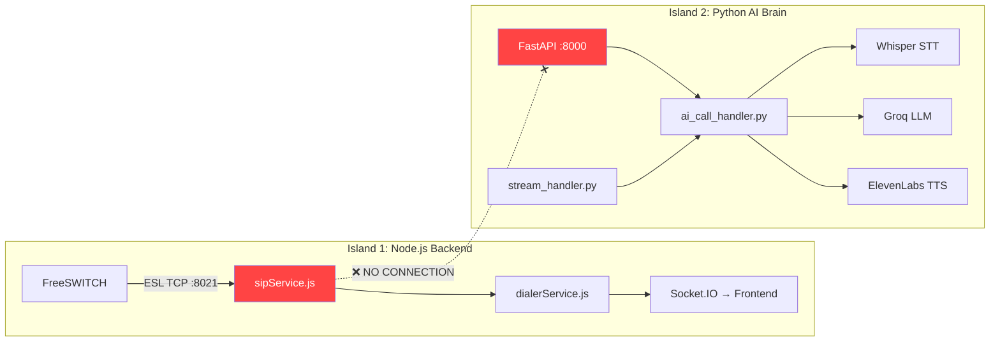
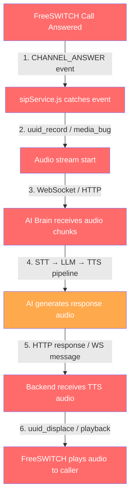

# 🔍 FreeSWITCH → Python AI Brain Bridge Analysis

## Verdict: ❌ CONNECTED NAHI HAI

FreeSWITCH aur Python AI Brain ke beech **koi actual bridge/connection exist nahi karta**. Dono systems independently banaye gaye hain aur dono ke beech koi wire nahi hai.

---

## Current Architecture — Two Isolated Islands



---

## Gap-by-Gap Breakdown

### Gap 1: ❌ No Audio Bridge (FreeSWITCH → AI Brain)

| What Exists | What's Missing |
|---|---|
| [sipService.js](file:///c:/Users/dubey/Desktop/telephony-crm (3)/backend/src/services/sipService.js) — ESL se FreeSWITCH connect hota hai | **Audio stream capture** — `CHANNEL_ANSWER` par audio ko intercept karke AI brain tak bhejne ka koi mechanism nahi hai |
| [stream_handler.py](file:///c:/Users/dubey/Desktop/telephony-crm (3)/ai_brain/audio/stream_handler.py) — `handle_audio_chunk()` method ready hai audio accept karne ke liye | **WebSocket/RTP listener** — AI brain me koi WebSocket server nahi hai jo FreeSWITCH se audio chunks receive kare |

> [!CAUTION]
> `sipService.js` me `CHANNEL_ANSWER` event subscribe hai lekin **koi handler nahi hai** — jab call answer hoti hai, kuch nahi hota! Audio capture hi nahi ho raha.

---

### Gap 2: ❌ No HTTP/WebSocket Call from Backend → AI Brain

| File | Finding |
|---|---|
| [sipService.js](file:///c:/Users/dubey/Desktop/telephony-crm (3)/backend/src/services/sipService.js) | No `axios`, no `fetch`, no `ws` import. AI Brain ka koi URL reference nahi. |
| [dialerService.js](file:///c:/Users/dubey/Desktop/telephony-crm (3)/backend/src/services/dialerService.js) | Calls originate karta hai, lekin call answer hone par AI Brain ko **notify nahi karta**. |
| [server.js](file:///c:/Users/dubey/Desktop/telephony-crm (3)/backend/server.js) | AI Brain service ka koi mention nahi — sirf `/ai-route` ek static route return karta hai. |
| [routes/index.js](file:///c:/Users/dubey/Desktop/telephony-crm (3)/backend/src/routes/index.js) | Koi proxy route ya AI Brain forward nahi hai. |

> [!IMPORTANT]
> Backend me `axios`, `node-fetch`, ya `ws` (WebSocket client) ka koi usage hi nahi hai — AI Brain se communicate karne ka koi mechanism nahi.

---

### Gap 3: ❌ AI Brain ke Endpoints Orphan Hain

[calls.py](file:///c:/Users/dubey/Desktop/telephony-crm (3)/ai_brain/routes/calls.py) me ye ready endpoints hain:

```
POST /calls/start        → Session create + greeting generate
POST /calls/turn/audio   → Audio → STT → LLM → TTS
POST /calls/turn/text    → Text → LLM → TTS  
POST /calls/end          → Session cleanup
GET  /calls/{call_id}    → Session status
```

**Lekin koi bhi service (backend ya FreeSWITCH) in endpoints ko call nahi karta.** Ye endpoints completely unused hain.

---

### Gap 4: ❌ No Audio Media Pipeline

| Required Step | Status |
|---|---|
| FreeSWITCH se RTP audio capture (`uuid_record`, `media_bug`, ya `mod_shout`) | ❌ Not implemented |
| Audio ko WebSocket/HTTP se AI Brain tak stream karna | ❌ Not implemented |
| AI Brain ka TTS response audio wapas FreeSWITCH ko bhejke playback karna | ❌ Not implemented |

> [!WARNING]
> `dialerService.js` (Line 66) calls originate karta hai with `'bridge', 'user/1001'` — ye call ko **static SIP extension 1001** se bridge karta hai, AI Brain se nahi. Matlab calls ek hardcoded user pe jaati hain, AI interact hi nahi karta.

---

### Gap 5: ❌ Docker Compose me AI Brain Missing

[docker-compose.yml](file:///c:/Users/dubey/Desktop/telephony-crm (3)/docker-compose.yml) me sirf 3 services hain:
- `postgres`
- `backend` (Node.js)
- `frontend`

**`ai_brain` service ka koi container, network, ya link defined nahi hai.**

---

### Gap 6: ❌ `ari_client.py` Stub Hai

[ari_client.py](file:///c:/Users/dubey/Desktop/telephony-crm (3)/ai_brain/telephony/ari_client.py) aur [call_events.py](file:///c:/Users/dubey/Desktop/telephony-crm (3)/ai_brain/telephony/call_events.py) — dono sirf **static dict return karte hain**, koi actual FreeSWITCH/ARI connection nahi.

---

## Summary: Kya Missing Hai (Bridge Banane Ke Liye)



> All red nodes = **completely missing implementation**  
> Orange node = code exists but unreachable (no one calls it)

### 6 Missing Pieces:

| # | Missing Piece | Where it should go |
|---|---|---|
| 1 | `CHANNEL_ANSWER` handler in sipService | [sipService.js](file:///c:/Users/dubey/Desktop/telephony-crm (3)/backend/src/services/sipService.js) |
| 2 | Audio capture mechanism (`uuid_record` / `mod_shout` / `media_bug`) | [sipService.js](file:///c:/Users/dubey/Desktop/telephony-crm (3)/backend/src/services/sipService.js) |
| 3 | WebSocket/HTTP client: Backend → AI Brain audio stream | New file needed in backend |
| 4 | WebSocket server in AI Brain to receive live audio | [stream_handler.py](file:///c:/Users/dubey/Desktop/telephony-crm (3)/ai_brain/audio/stream_handler.py) or new WS endpoint |
| 5 | TTS audio playback: AI response → FreeSWITCH playback | [sipService.js](file:///c:/Users/dubey/Desktop/telephony-crm (3)/backend/src/services/sipService.js) |
| 6 | AI Brain service in docker-compose | [docker-compose.yml](file:///c:/Users/dubey/Desktop/telephony-crm (3)/docker-compose.yml) |
